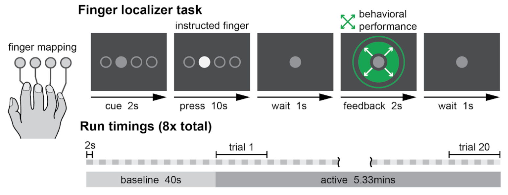

# Realtime fMRI filtering

This code repository is for trying out different types of filtering for real-time fMRI in Python. Sample Matlab code can also be found in the `matlab` subdirectory.

## Datasets

Datasets are available upon request. The experimental design is shown below:

Each run begins with 40 seconds of baseline rest, followed by 20 trials of 16 seconds each. In each trial, the person was pressing one of 4 fingers for 10 seconds of that period. fMRI images are captured once each 'repetition time', or 'TR'. In this dataset, each TR is 2 seconds long. Therefore, the overall fMRI dataset in `fmri_data` is `(40+20*16)*8/2`.

