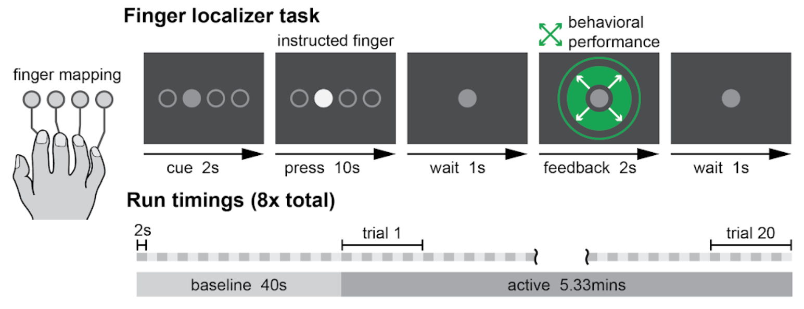

# Realtime fMRI filtering

This code repository is for trying out different types of filtering for real-time fMRI.

## Datasets

I have included one dataset from one participant for now, contained in `data/finger_data.mat`. You can load it simply using `load('data/finger_data.mat')`, which should load 3 variables into your workspace: `fmri_data`, which contains the raw fMRI data; `labels`, which contains the labels for what the participant was doing (`-1:rest, 0:index, 1:middle, 2:ring, 3:pinky`); and `runs`, which indicates which fMRI 'run' the data came from (data is split up into 8 runs, which are coded from 0-7 in this variables). The experimental design is shown below:

Each run begins with 40 seconds of baseline rest, followed by 20 trials of 16 seconds each. In each trial, the person was pressing one of 4 fingers for 10 seconds of that period. fMRI images are captured once each 'repetition time', or 'TR'. In this dataset, each TR is 2 seconds long. Therefore, the overall fMRI dataset in `fmri_data` is `(40+20*16)*8/2` TRs long, e.g. `(baseline_time+num_trials*trial_time)*num_runs/TR_time`, or 1440 TRs total. The data provided is extracted from a mask of primary motor cortex and primary somatosensory cortex. Each voxel is 2.3mm&ast;2.3mm&ast;2.3mm, and in this data (from a sample participant) ends up being 2323 voxels total, although this changes on a person-to-person basis. Therefore, the raw `fmri_data` is a `n_TRs*n_voxels` matrix, or `1440*2323`. The finger labels and run markers have one value for each TR in the dataset, and are therefore `1*1440` matrices (or vectors).

A sample script is included in `sample_processing.m` which does simple z-scoring on the data, followed by using multinomial logistic regression on the processed dataset.

## Multinomial Logistic Regression Toolbox

Code from Okito Yamashita's Sparse Logistic Regression toolbox is included in the subdirectory `mlr_toolbox`, including instructions on how to use the code in `mlr_toolbox/README.pdf`. This is the code you'll use to distinguish between which finger participants are pressing, after doing the desired preprocessing steps. Sparse Multinomial Logistic Regression is the most powerful, but also the most time-consuming method here, so you'll probably want to start with Regularized Multinomial Logistic Regression, 1-vs-Rest (which will calculate much quicker). We need "Multinomial" (versus standard logistic regression) because we're going to be distinguishing between 4 different types of data (i.e. 4 different fingers), rather than just between 2 types (where standard binary logistic regresion is used). There are some demo scripts here (e.g. `mlr_toolbox/demo_multiclass_classification.m`) to get you started. If you want to use any of the matlab functions from this toolbox from the main directory, you'll need to add the `mlr_toolbox` subdirectory to your Matlab path. A quick trick is to include the command `addpath(genpath(pwd))` at the top of your script, which will add all current subdirectories to your Matlab path.

